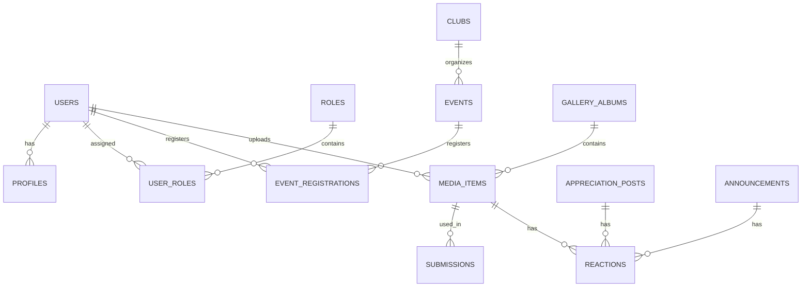

# 06 - ER Diagram (Conceptual)

This file describes relationships in text form; generate a diagram using tools (draw.io, mermaid) from the definitions below.

Entities & relationships (summary):
- users 1---1 profiles
- users 1---* user_roles *---1 roles
- clubs 1---* events
- events 1---* event_registrations
- users 1---* event_registrations
- gallery_albums 1---* media_items
- users 1---* media_items
- media_items 1---0..1 submissions
- appreciation_posts 1---* reactions
- media_items 1---* reactions
- announcements 1---* reactions (optional)

Mermaid sample (copy to a .md renderer):

Guidance:
- Use UUID PKs for portability.
- Add audit fields and created_by relationships for traceability.
- Use normalized join tables for many-to-many (user_roles).

Export: Create a visual ER diagram as part of implementation (recommended tool: dbdiagram.io or Mermaid).